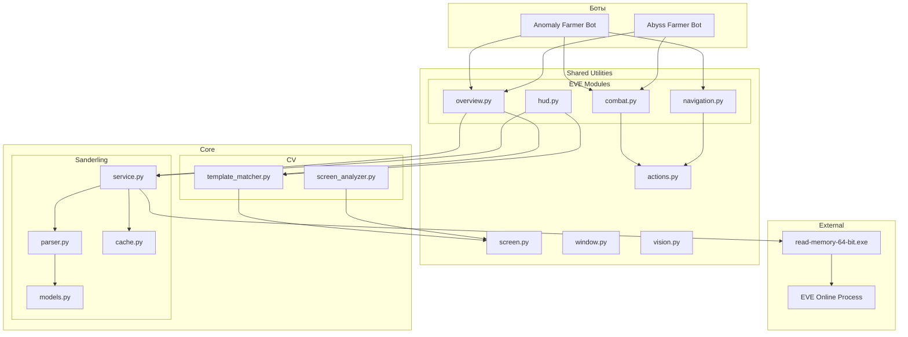

# Документ дизайна

## Обзор

Этот документ описывает дизайн реорганизации проекта EVE Online бота и улучшения модуля чтения памяти Sanderling. Основные цели:

1. **Реорганизация структуры проекта** - создание четкой иерархии папок с разделением на core компоненты, боты, общие утилиты и служебные файлы
2. **Улучшение модуля Sanderling** - обеспечение стабильной, быстрой и автоматизированной работы чтения памяти
3. **Унификация инструментов** - создание единого набора утилит для всех ботов

Проект использует гибридный подход: Sanderling для точного чтения данных из памяти и CV инструменты (template matching) как fallback механизм.

## Архитектура

### Новая структура проекта

```
eve-online-bot/
├── core/                          # Ядро системы
│   ├── sanderling/               # Модуль чтения памяти
│   │   ├── __init__.py
│   │   ├── service.py            # Фоновый сервис
│   │   ├── parser.py             # Парсер UI tree
│   │   ├── models.py             # Модели данных
│   │   ├── cache.py              # Кэширование root address
│   │   ├── config.py             # Конфигурация
│   │   ├── test_parser.py        # Тесты парсера
│   │   ├── test_data/            # Тестовые данные
│   │   └── README.md
│   │
│   └── cv/                       # Компьютерное зрение
│       ├── __init__.py
│       ├── template_matcher.py   # Template matching
│       ├── screen_analyzer.py    # Анализ экрана
│       └── README.md
│
├── shared/                        # Общие утилиты
│   ├── __init__.py
│   ├── actions.py                # Мышь и клавиатура
│   ├── screen.py                 # Скриншоты
│   ├── window.py                 # Управление окнами
│   ├── vision.py                 # Базовые CV операции
│   ├── eve/                      # EVE-специфичные модули
│   │   ├── __init__.py
│   │   ├── overview.py           # Работа с Overview
│   │   ├── hud.py                # Работа с HUD
│   │   ├── navigation.py         # Навигация
│   │   ├── combat.py             # Боевые действия
│   │   └── telegram_notifier.py  # Уведомления
│   └── README.md
│
├── bots/                          # Готовые боты
│   ├── anomaly_farmer/           # Бот для аномалий
│   │   ├── __init__.py
│   │   ├── main.py               # Основной скрипт
│   │   ├── config.json           # Конфигурация бота
│   │   └── README.md
│   │
│   ├── abyss_farmer/             # Бот для абиссов (заготовка)
│   │   ├── __init__.py
│   │   ├── main.py
│   │   ├── config.json
│   │   └── README.md
│   │
│   └── README.md
│
├── external/                      # Внешние зависимости
│   ├── Sanderling/               # Исходники C#
│   └── sanderling-bin/           # Скомпилированные бинарники
│
├── resources/                     # Ресурсы
│   ├── assets/                   # Изображения для CV
│   └── config/                   # Конфигурационные файлы
│       ├── sanderling.json
│       └── telegram.json
│
├── output/                        # Выходные данные
│   ├── logs/                     # Логи
│   ├── debug/                    # Дебаг данные
│   ├── data/                     # JSON данные
│   └── temp/                     # Временные файлы
│
├── docs/                          # Документация
│   ├── examples/                 # Примеры кода
│   ├── MIGRATION.md              # Руководство по миграции
│   └── API.md                    # API документация
│
├── dev_tools/                     # Инструменты разработки
│   ├── capture.py
│   ├── crop.py
│   └── windows.py
│
├── scripts/                       # Вспомогательные скрипты
│   ├── validate_sanderling.py
│   └── migrate_structure.py
│
├── .env                          # Переменные окружения
├── requirements.txt              # Python зависимости
└── README.md                     # Главная документация
```

### Диаграмма компонентов



## Компоненты и интерфейсы

### 1. Sanderling Service (core/sanderling/service.py)

Фоновый сервис для управления процессом чтения памяти.

```python
class SanderlingService:
    """Фоновый сервис для чтения памяти EVE Online через Sanderling."""
    
    def __init__(self, config: SanderlingConfig):
        """
        Инициализация сервиса.
        
        Args:
            config: Конфигурация Sanderling
        """
        self.config = config
        self.cache = RootAddressCache()
        self.parser = UITreeParser()
        self.process_handle = None
        self.eve_process_id = None
        self.is_running = False
        self.last_state = None
        self.error_count = 0
        
    def start(self) -> bool:
        """
        Запустить сервис.
        
        Returns:
            True если запуск успешен, False иначе
        """
        pass
        
    def stop(self) -> None:
        """Остановить сервис."""
        pass
        
    def get_state(self) -> Optional[GameState]:
        """
        Получить текущее состояние игры.
        
        Returns:
            GameState или None если данные недоступны
        """
        pass
        
    def _find_eve_process(self) -> Optional[int]:
        """Найти процесс EVE Online."""
        pass
        
    def _read_memory(self) -> Optional[dict]:
        """Прочитать память и вернуть UI tree."""
        pass
        
    def _handle_error(self, error: Exception) -> None:
        """Обработать ошибку чтения."""
        pass
```

### 2. UI Tree Parser (core/sanderling/parser.py)

Парсер для извлечения данных из UI tree.

```python
class UITreeParser:
    """Парсер UI tree из Sanderling."""
    
    def parse(self, ui_tree: dict) -> GameState:
        """
        Распарсить UI tree в структурированное состояние.
        
        Args:
            ui_tree: Словарь с UI tree от Sanderling
            
        Returns:
            GameState с извлеченными данными
        """
        pass
        
    def _parse_targets(self, node: dict) -> List[Target]:
        """Извлечь залоченные цели."""
        pass
        
    def _parse_overview(self, node: dict) -> List[OverviewEntry]:
        """Извлечь записи Overview."""
        pass
        
    def _parse_modules(self, node: dict) -> List[Module]:
        """Извлечь модули корабля."""
        pass
        
    def _find_nodes_by_type(self, node: dict, type_name: str) -> List[dict]:
        """Найти все узлы определенного типа."""
        pass
        
    def _extract_coordinates(self, node: dict) -> Optional[Tuple[int, int]]:
        """Извлечь координаты элемента."""
        pass
```

### 3. Root Address Cache (core/sanderling/cache.py)

Кэширование адреса UI root для быстрого запуска.

```python
class RootAddressCache:
    """Кэш для хранения root address UI tree."""
    
    def __init__(self, cache_file: str = "output/data/sanderling_cache.json"):
        """
        Инициализация кэша.
        
        Args:
            cache_file: Путь к файлу кэша
        """
        self.cache_file = cache_file
        self.data = self._load()
        
    def get(self, process_id: int) -> Optional[str]:
        """
        Получить root address для процесса.
        
        Args:
            process_id: ID процесса EVE
            
        Returns:
            Root address или None если не найден
        """
        pass
        
    def set(self, process_id: int, root_address: str) -> None:
        """
        Сохранить root address.
        
        Args:
            process_id: ID процесса EVE
            root_address: Адрес UI root
        """
        pass
        
    def invalidate(self, process_id: int) -> None:
        """Инвалидировать кэш для процесса."""
        pass
        
    def _load(self) -> dict:
        """Загрузить кэш из файла."""
        pass
        
    def _save(self) -> None:
        """Сохранить кэш в файл."""
        pass
        
    def _is_valid(self, entry: dict) -> bool:
        """Проверить валидность записи кэша."""
        pass
```

### 4. Configuration (core/sanderling/config.py)

Управление конфигурацией Sanderling.

```python
@dataclass
class SanderlingConfig:
    """Конфигурация Sanderling."""
    
    enabled: bool = True
    fallback_to_cv: bool = True
    cache_enabled: bool = True
    read_interval_ms: int = 200
    max_retries: int = 3
    timeout_ms: int = 5000
    binary_path: str = "external/sanderling-bin/read-memory-64-bit.exe"
    debug_mode: bool = False
    
    @classmethod
    def load(cls, config_file: str = "resources/config/sanderling.json") -> "SanderlingConfig":
        """Загрузить конфигурацию из файла."""
        pass
        
    def save(self, config_file: str = "resources/config/sanderling.json") -> None:
        """Сохранить конфигурацию в файл."""
        pass
        
    def validate(self) -> bool:
        """Валидировать значения конфигурации."""
        pass
```

### 5. Hybrid Overview Module (shared/eve/overview.py)

Модуль работы с Overview с поддержкой Sanderling и CV.

```python
class OverviewManager:
    """Менеджер для работы с Overview (гибридный режим)."""
    
    def __init__(self, sanderling_service: Optional[SanderlingService] = None):
        """
        Инициализация менеджера.
        
        Args:
            sanderling_service: Сервис Sanderling (опционально)
        """
        self.sanderling = sanderling_service
        self.cv_matcher = TemplateMatcher()
        
    def count_targets(self) -> int:
        """
        Подсчитать количество целей в Overview.
        
        Returns:
            Количество целей
        """
        # Попытка через Sanderling
        if self.sanderling and self.sanderling.is_running:
            try:
                state = self.sanderling.get_state()
                if state and state.overview:
                    return len(state.overview)
            except Exception as e:
                logger.warning(f"Sanderling failed, falling back to CV: {e}")
        
        # Fallback на CV
        return self._count_targets_cv()
        
    def lock_all_targets(self) -> None:
        """Залочить все цели в Overview."""
        pass
        
    def get_target_at(self, index: int) -> Optional[OverviewEntry]:
        """Получить цель по индексу."""
        pass
        
    def _count_targets_cv(self) -> int:
        """Подсчитать цели через CV."""
        pass
```

## Модели данных

### GameState

```python
@dataclass
class GameState:
    """Состояние игры из UI tree."""
    
    targets: List[Target]
    overview: List[OverviewEntry]
    ship: ShipState
    timestamp: float
    is_valid: bool = True
    warnings: List[str] = field(default_factory=list)
```

### Target

```python
@dataclass
class Target:
    """Залоченная цель."""
    
    name: str
    type: str
    distance: Optional[float]
    is_active: bool
    center: Optional[Tuple[int, int]]
    bounds: Optional[Tuple[int, int, int, int]]  # x, y, width, height
```

### OverviewEntry

```python
@dataclass
class OverviewEntry:
    """Запись в Overview."""
    
    index: int
    center: Optional[Tuple[int, int]]
    bounds: Optional[Tuple[int, int, int, int]]
```

### Module

```python
@dataclass
class Module:
    """Модуль корабля."""
    
    slot_type: str  # 'high', 'mid', 'low'
    slot_name: str
    is_active: bool
    center: Optional[Tuple[int, int]]
```

### ShipState

```python
@dataclass
class ShipState:
    """Состояние корабля."""
    
    modules: List[Module]
```

### CacheEntry

```python
@dataclass
class CacheEntry:
    """Запись в кэше root address."""
    
    root_address: str
    process_id: int
    timestamp: float
    game_version: Optional[str] = None
```

## Алгоритмы

### Алгоритм запуска Sanderling Service

```
1. Загрузить конфигурацию из resources/config/sanderling.json
2. Валидировать конфигурацию
3. Найти процесс EVE Online:
   a. Получить список всех процессов
   b. Найти процесс с именем "exefile.exe"
   c. Если не найден, ждать 5 секунд и повторить
4. Загрузить root address из кэша:
   a. Проверить существование файла кэша
   b. Загрузить данные для текущего process_id
   c. Валидировать timestamp (не старше 24 часов)
5. Если root address в кэше:
   a. Запустить read-memory-64-bit.exe с --root-address
   b. Если успешно, перейти к шагу 7
   c. Если ошибка, инвалидировать кэш и перейти к шагу 6
6. Если root address не в кэше:
   a. Запустить read-memory-64-bit.exe без --root-address
   b. Дождаться завершения (может занять ~20 секунд)
   c. Извлечь root address из вывода
   d. Сохранить в кэш
7. Запустить фоновый цикл чтения:
   a. Каждые read_interval_ms миллисекунд
   b. Читать память с известным root address
   c. Парсить UI tree
   d. Обновлять last_state
8. Обрабатывать ошибки:
   a. При ошибке чтения повторить до max_retries раз
   b. Если все попытки неудачны, инвалидировать кэш
   c. Выполнить полный поиск root address
```

### Алгоритм парсинга UI Tree

```
1. Получить корневой узел UI tree
2. Рекурсивно обойти дерево:
   a. Для каждого узла проверить pythonObjectTypeName
   b. Если тип "TargetInBar":
      - Извлечь имя из dictEntriesOfInterest._name
      - Извлечь координаты из _displayX, _displayY
      - Проверить наличие ActiveTargetIndicator в children
      - Добавить в список targets
   c. Если тип "OverviewScrollEntry":
      - Извлечь координаты
      - Добавить в список overview
   d. Если тип "ShipSlot":
      - Определить тип слота (high/mid/low)
      - Проверить активность
      - Добавить в список modules
3. Валидировать извлеченные данные:
   a. Проверить что координаты в пределах экрана
   b. Проверить что имена не пустые
   c. Добавить warnings для невалидных данных
4. Создать GameState с извлеченными данными
5. Вернуть GameState
```

### Алгоритм гибридного подсчета целей

```
1. Проверить доступность Sanderling:
   a. Если сервис запущен и is_running == True
   b. Попытаться получить state
2. Если Sanderling доступен:
   a. Получить state.overview
   b. Вернуть len(state.overview)
3. Если Sanderling недоступен или ошибка:
   a. Записать warning в лог
   b. Fallback на CV метод:
      - Сделать скриншот области Overview
      - Найти шаблон заголовка Overview
      - Подсчитать строки через анализ пикселей
      - Вернуть количество строк
4. Если CV тоже не работает:
   a. Записать error в лог
   b. Вернуть 0
```

### Алгоритм обработки ошибок

```
1. При возникновении ошибки чтения:
   a. Увеличить error_count
   b. Записать детали ошибки в лог
2. Если error_count < max_retries:
   a. Подождать 1 секунду
   b. Повторить операцию чтения
3. Если error_count >= max_retries:
   a. Инвалидировать кэш root address
   b. Выполнить полный поиск root address
   c. Сбросить error_count
4. Если ошибки продолжаются более 30 секунд:
   a. Переключиться на fallback (CV)
   b. Записать событие в лог
   c. Продолжить попытки восстановления в фоне
5. Если восстановление успешно:
   a. Записать событие восстановления в лог
   b. Сбросить error_count
   c. Переключиться обратно на Sanderling
```

## Миграция существующего кода

### Этапы миграции

1. **Создание новой структуры папок**
   - Создать все директории согласно новой структуре
   - Скопировать файлы в соответствующие папки

2. **Перемещение core компонентов**
   - `eve/sanderling/` → `core/sanderling/`
   - Создать `core/cv/` и переместить CV логику

3. **Создание shared утилит**
   - `eve/actions.py` → `shared/actions.py`
   - `eve/screen.py` → `shared/screen.py`
   - `eve/window.py` → `shared/window.py`
   - `eve/vision.py` → `shared/vision.py`
   - `eve/overview.py` → `shared/eve/overview.py`
   - `eve/hud.py` → `shared/eve/hud.py`
   - `eve/navigation.py` → `shared/eve/navigation.py`
   - `eve/combat.py` → `shared/eve/combat.py`
   - `eve/telegram_notifier.py` → `shared/eve/telegram_notifier.py`

4. **Реорганизация ботов**
   - `scripts/eve_farm_bot.py` → `bots/anomaly_farmer/main.py`
   - Создать заготовку `bots/abyss_farmer/main.py`

5. **Перемещение внешних зависимостей**
   - `Sanderling/` → `external/Sanderling/`
   - `sanderling-bin/` → `external/sanderling-bin/`

6. **Реорганизация ресурсов**
   - `assets/` → `resources/assets/`
   - Создать `resources/config/` и переместить конфиги

7. **Реорганизация служебных файлов**
   - `logs/` → `output/logs/`
   - `data/` → `output/data/`
   - `inbox/` → `output/debug/`
   - `temp/` → `output/temp/`

8. **Обновление импортов**
   - Обновить все `import` и `from` statements
   - Обновить пути к файлам в коде

9. **Создание документации**
   - Создать README файлы в каждой папке
   - Создать примеры в `docs/examples/`
   - Создать `docs/MIGRATION.md`

### Скрипт миграции

Создать `scripts/migrate_structure.py` который автоматически:
- Создает новую структуру папок
- Копирует файлы в новые локации
- Обновляет импорты (с помощью regex)
- Создает backup старой структуры


## Свойства корректности

*Свойство - это характеристика или поведение, которое должно быть истинным для всех валидных выполнений системы - по сути, формальное утверждение о том, что система должна делать. Свойства служат мостом между человекочитаемыми спецификациями и машинно-проверяемыми гарантиями корректности.*

### Property Reflection

После анализа всех критериев приемки выявлены следующие группы свойств, которые можно объединить:

**Группа 1: Кэширование Root Address (3.1-3.5)**
- Свойства 3.1, 3.2, 3.4 можно объединить в одно комплексное свойство о round-trip кэширования
- Свойство 3.3 остается отдельным как обработка ошибок
- Свойство 3.5 остается отдельным как инвалидация при перезапуске

**Группа 2: Парсинг UI Tree (7.1-7.5)**
- Свойства 7.1, 7.2, 7.3 можно объединить в одно свойство о полноте парсинга
- Свойство 7.4 остается отдельным как валидация
- Свойство 7.5 остается отдельным как обработка невалидных данных

**Группа 3: Обработка ошибок (6.1-6.6)**
- Свойства 6.1 и 6.2 можно объединить в одно свойство о retry механизме
- Остальные свойства уникальны

**Группа 4: Логирование (9.1-9.5)**
- Свойства 9.1 и 9.2 можно объединить в одно свойство о логировании событий
- Остальные свойства уникальны

### Свойства

**Property 1: Кэширование Root Address (Round Trip)**

*Для любого* валидного root address и process ID, если адрес сохранен в кэш, то при последующей загрузке должен быть получен эквивалентный адрес с корректными метаданными (process_id, timestamp).

**Validates: Requirements 3.1, 3.2, 3.4**

---

**Property 2: Инвалидация кэша при невалидном адресе**

*Для любого* невалидного root address в кэше, попытка использования должна привести к инвалидации кэша и выполнению полного поиска.

**Validates: Requirements 3.3**

---

**Property 3: Инвалидация кэша при перезапуске процесса**

*Для любого* process ID в кэше, если процесс с этим ID перезапущен (новый PID), то кэш должен быть инвалидирован и выполнен новый поиск.

**Validates: Requirements 3.5**

---

**Property 4: Кэширование парсинга при неизменном UI Tree**

*Для любого* UI tree, если он читается дважды без изменений, то второй парсинг должен использовать кэшированные данные (не выполняться повторно).

**Validates: Requirements 4.3**

---

**Property 5: Логирование медленных операций**

*Для любой* операции чтения памяти, если она занимает более 500 миллисекунд, то в лог должно быть записано предупреждение с временем выполнения.

**Validates: Requirements 4.4**

---

**Property 6: Измерение времени всех операций**

*Для любой* операции чтения памяти, время выполнения должно быть измерено и залогировано.

**Validates: Requirements 4.5**

---

**Property 7: Автоматический поиск процесса EVE**

*Для любого* запуска бота, если процесс EVE Online существует, он должен быть автоматически найден по имени "exefile.exe".

**Validates: Requirements 5.1**

---

**Property 8: Ожидание появления процесса EVE**

*Для любого* запуска бота, если процесс EVE не найден, система должна проверять его наличие каждые 5 секунд до обнаружения.

**Validates: Requirements 5.2**

---

**Property 9: Автоматический запуск Sanderling при обнаружении процесса**

*Для любого* обнаруженного процесса EVE, должен быть автоматически запущен read-memory-64-bit.exe с корректными параметрами (--pid, --root-address если есть в кэше).

**Validates: Requirements 5.3**

---

**Property 10: Неблокирующий запуск Sanderling**

*Для любого* запуска Sanderling, основной поток должен продолжать выполнение (не блокироваться), и сервис должен работать в фоновом режиме.

**Validates: Requirements 5.4**

---

**Property 11: Корректное завершение процесса при остановке**

*Для любого* запущенного процесса read-memory-64-bit.exe, при остановке бота процесс должен быть корректно завершен (не остаться висеть).

**Validates: Requirements 5.5**

---

**Property 12: Обнаружение завершения процесса EVE**

*Для любого* работающего Sanderling, если процесс EVE завершается, Sanderling должен обнаружить это и автоматически остановиться.

**Validates: Requirements 5.6**

---

**Property 13: Retry механизм при ошибках чтения**

*Для любой* ошибки чтения памяти, система должна повторить попытку до 3 раз с задержкой 1 секунда, и если все попытки неудачны, инвалидировать кэш и выполнить полный поиск.

**Validates: Requirements 6.1, 6.2**

---

**Property 14: Логирование ошибок парсинга с продолжением работы**

*Для любой* ошибки парсинга UI Tree, детальная информация должна быть записана в лог, и система должна продолжить работу (не упасть).

**Validates: Requirements 6.3**

---

**Property 15: Fallback на CV при длительной недоступности**

*Для любого* состояния недоступности Sanderling, если оно длится более 30 секунд, система должна переключиться на Template Matching как fallback.

**Validates: Requirements 6.4**

---

**Property 16: Логирование восстановления**

*Для любого* успешного восстановления Sanderling после ошибки, событие восстановления должно быть записано в лог.

**Validates: Requirements 6.5**

---

**Property 17: Мониторинг частоты ошибок**

*Для любого* периода работы, если происходит более 10 ошибок за 5 минут, система должна записать предупреждение в лог.

**Validates: Requirements 6.6**

---

**Property 18: Полнота парсинга UI Tree**

*Для любого* валидного UI tree содержащего цели, Overview записи или модули корабля, парсер должен извлечь все соответствующие данные (имена, координаты, статусы).

**Validates: Requirements 7.1, 7.2, 7.3**

---

**Property 19: Валидация извлеченных данных**

*Для любых* данных извлеченных из UI tree, они должны быть валидированы перед возвратом (координаты в пределах экрана, имена не пустые).

**Validates: Requirements 7.4**

---

**Property 20: Частичные данные с предупреждением при невалидности**

*Для любого* UI tree с невалидными или неполными данными, парсер должен вернуть частичные данные с установленным флагом предупреждения (is_valid=False, warnings заполнен).

**Validates: Requirements 7.5**

---

**Property 21: Применение конфигурации без перезапуска**

*Для любого* изменения в файле конфигурации, новые настройки должны быть применены без перезапуска сервиса.

**Validates: Requirements 8.2**

---

**Property 22: Валидация конфигурации при загрузке**

*Для любого* файла конфигурации, при загрузке все значения должны быть валидированы (типы, диапазоны).

**Validates: Requirements 8.3**

---

**Property 23: Defaults при невалидной конфигурации**

*Для любой* невалидной конфигурации, система должна использовать значения по умолчанию и записать предупреждение в лог.

**Validates: Requirements 8.4**

---

**Property 24: Логирование событий с корректным форматом имени файла**

*Для любого* запуска Sanderling, лог файл должен быть создан в output/logs/ с именем формата sanderling_YYYYMMDD_HHMMSS.log, и все важные события должны быть залогированы.

**Validates: Requirements 9.1, 9.2**

---

**Property 25: Периодическое логирование метрик**

*Для любого* периода работы длительностью более 60 секунд, метрики производительности (среднее время, количество операций, ошибки) должны быть записаны в лог.

**Validates: Requirements 9.3**

---

**Property 26: Сохранение снимков UI Tree в debug режиме**

*Для любой* операции чтения памяти в debug режиме, снимок UI tree должен быть сохранен в output/debug/ с именем формата ui_tree_HHMMSS.json.

**Validates: Requirements 9.4**

---

**Property 27: Ротация старых лог файлов**

*Для любого* лог файла старше 7 дней, он должен быть удален при следующем запуске системы.

**Validates: Requirements 9.5**

---

**Property 28: Корректность тестов парсера**

*Для любого* запуска test_parser.py с тестовыми данными, все проверки извлечения данных (цели, Overview, модули) должны пройти успешно.

**Validates: Requirements 11.3**

---

**Property 29: Полный цикл валидации**

*Для любого* запуска validate_sanderling.py, должны быть выполнены все этапы: поиск процесса → чтение памяти → парсинг → вывод результатов, без ошибок.

**Validates: Requirements 11.5**

## Обработка ошибок

### Типы ошибок

1. **Ошибки поиска процесса**
   - Процесс EVE не найден
   - Обработка: Ожидание с периодической проверкой каждые 5 секунд

2. **Ошибки чтения памяти**
   - Невалидный root address
   - Процесс завершился
   - Таймаут операции
   - Обработка: Retry до 3 раз, затем инвалидация кэша и полный поиск

3. **Ошибки парсинга**
   - Невалидная структура UI tree
   - Отсутствующие поля
   - Обработка: Логирование, возврат частичных данных с warnings

4. **Ошибки конфигурации**
   - Невалидный JSON
   - Некорректные значения
   - Обработка: Использование defaults, логирование warning

5. **Ошибки файловой системы**
   - Невозможность создать лог файл
   - Невозможность сохранить кэш
   - Обработка: Логирование в stderr, продолжение работы

### Стратегия восстановления

```
┌─────────────────────────────────────────────────────────────┐
│                    Нормальная работа                         │
│                                                              │
│  Sanderling читает память → Парсит UI tree → Возвращает данные│
└─────────────────────────────────────────────────────────────┘
                            ↓ Ошибка
┌─────────────────────────────────────────────────────────────┐
│                    Retry механизм                            │
│                                                              │
│  Попытка 1 → Ошибка → Ждать 1 сек                          │
│  Попытка 2 → Ошибка → Ждать 1 сек                          │
│  Попытка 3 → Ошибка                                         │
└─────────────────────────────────────────────────────────────┘
                            ↓ Все попытки неудачны
┌─────────────────────────────────────────────────────────────┐
│                Инвалидация и полный поиск                    │
│                                                              │
│  Инвалидировать кэш → Полный поиск root address (~20 сек)   │
└─────────────────────────────────────────────────────────────┘
                            ↓ Если все еще не работает
┌─────────────────────────────────────────────────────────────┐
│                    Fallback на CV                            │
│                                                              │
│  Переключиться на Template Matching                          │
│  Продолжать попытки восстановления Sanderling в фоне         │
└─────────────────────────────────────────────────────────────┘
                            ↓ Восстановление
┌─────────────────────────────────────────────────────────────┐
│                Возврат к нормальной работе                   │
│                                                              │
│  Залогировать восстановление → Переключиться обратно         │
└─────────────────────────────────────────────────────────────┘
```

### Логирование ошибок

Все ошибки должны логироваться с следующей информацией:
- Timestamp
- Тип ошибки
- Детальное сообщение
- Stack trace (для критических ошибок)
- Контекст (process_id, root_address, и т.д.)

Формат лога:
```
[2026-02-04 15:30:45.123] [ERROR] [SanderlingService] Failed to read memory: Invalid root address 0x276A59E2CF8
  Process ID: 12345
  Retry attempt: 1/3
  Stack trace: ...
```

## Стратегия тестирования

### Двойной подход к тестированию

Проект будет использовать комбинацию unit тестов и property-based тестов:

**Unit тесты** - для конкретных примеров, edge cases и интеграционных точек:
- Проверка существования файлов после миграции
- Проверка корректности импортов
- Проверка формата конфигурационных файлов
- Интеграционные тесты с mock процессами

**Property-based тесты** - для универсальных свойств:
- Кэширование и инвалидация
- Парсинг различных UI tree
- Обработка ошибок
- Логирование событий

### Конфигурация Property-Based тестов

Будет использоваться библиотека **Hypothesis** для Python:
- Минимум 100 итераций на тест
- Каждый тест помечен комментарием с ссылкой на свойство из дизайна
- Формат тега: `# Feature: project-restructure-and-sanderling-improvements, Property N: <текст свойства>`

### Тестовые данные

Создать набор тестовых UI tree в `core/sanderling/test_data/`:
- `empty_ui_tree.json` - пустое дерево
- `with_targets.json` - дерево с залоченными целями
- `with_overview.json` - дерево с Overview записями
- `with_modules.json` - дерево с модулями корабля
- `invalid_structure.json` - невалидная структура
- `partial_data.json` - неполные данные

### Тестовые сценарии

1. **Тест миграции структуры**
   - Запустить скрипт миграции
   - Проверить существование всех папок
   - Проверить что файлы скопированы
   - Проверить что импорты работают

2. **Тест кэширования**
   - Сохранить root address в кэш
   - Загрузить из кэша
   - Проверить эквивалентность
   - Инвалидировать и проверить

3. **Тест парсинга**
   - Загрузить тестовые UI tree
   - Распарсить каждый
   - Проверить извлеченные данные
   - Проверить валидацию

4. **Тест обработки ошибок**
   - Симулировать различные ошибки
   - Проверить retry механизм
   - Проверить инвалидацию кэша
   - Проверить fallback на CV

5. **Тест логирования**
   - Выполнить операции
   - Проверить создание лог файлов
   - Проверить содержимое логов
   - Проверить ротацию старых файлов

6. **Интеграционный тест**
   - Запустить полный цикл с mock процессом EVE
   - Проверить все этапы: поиск → чтение → парсинг → возврат данных
   - Проверить обработку ошибок
   - Проверить восстановление

### Метрики покрытия

Целевые метрики:
- Покрытие кода тестами: >80%
- Все критические пути покрыты
- Все обработчики ошибок протестированы
- Все публичные API имеют тесты
